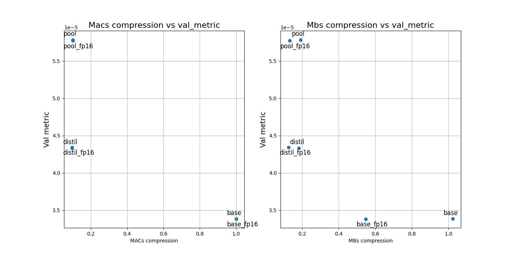

# kws_project

Compressed model by FLOPs and MBs up to 10 times using quantisation and distillation.

## Models loading
To load models use appropriate function from utils.py

## Wandb Report

Link to [report](https://wandb.ai/diddone/dla-kws/reports/KWS--VmlldzoyOTIxOTM4?accessToken=yjo4figdttviz4kk0henifqge8punh44p10srs38965vl0gvq2e1s84a8ifwo4dk)

## Plots

